  

### 🥷 Vibe Coding
> "Coding with the flow, shipping with soul." 🚀

### 💻 What I Do?
**I work, build, and experiment with vibe coding.** Most of my magic happens in **private repos**, where I have the freedom to create without limits.

* 📱 **Mobile:** Projects in **Flutter** (Dart & Kotlin) within my private repositories.
* ⚡ **Vercel:** I love using **vercel.app** to bring my ideas to life quickly.
* ⚙️ **Automation:** **GitHub Actions** are essential to my workflow.

---

### 🛠️ Tech Stack

  
  
  
  
  

---

### 🐍 Contribution Activity

  

  

